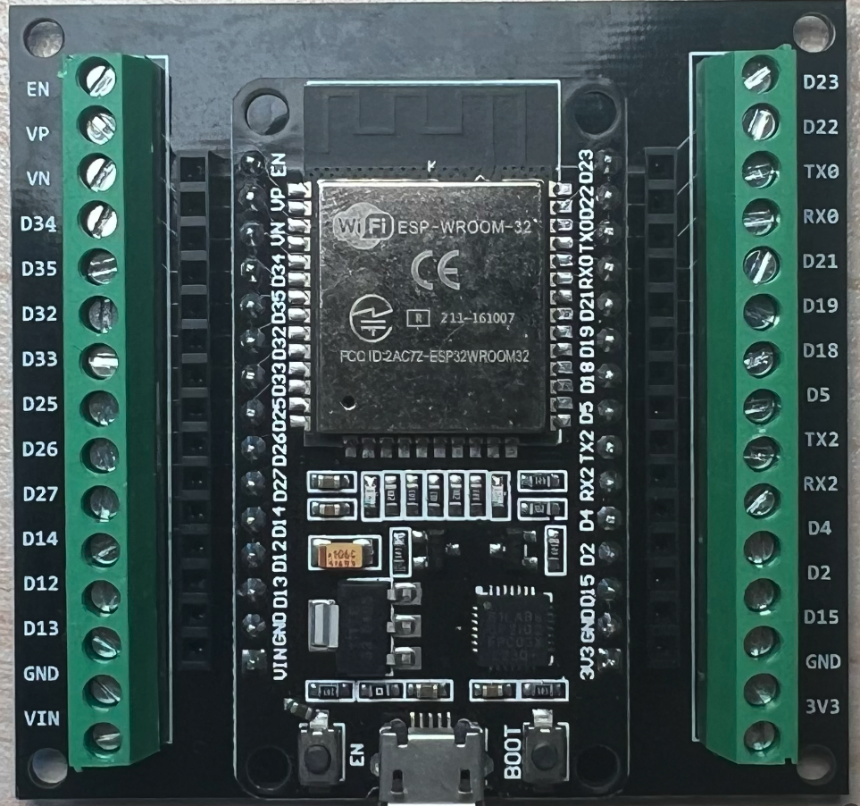
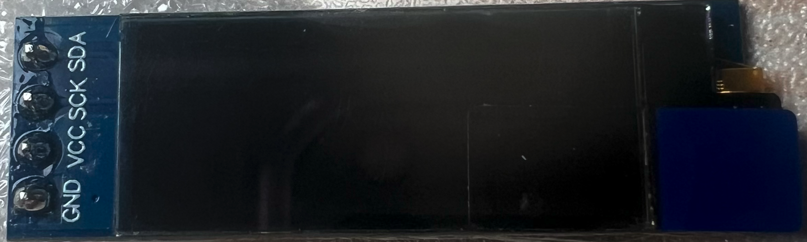

starter code for the esp32-wroom


## Getting Started

1. At thte project root, create a secretes.ini file and pupulate it the file with the following

```bash
[secrets]
wifi_ssid = "your wifi namme"
wifi_pass = "your wifi password"
```

2. Assuming you have a MQTT broker running and you're using a different host, port and topic, change the setup function in main.cpp

```bash
const char* MQTT_HOST = "192.168.1.66";
const uint16_t MQTT_PORT = 1883;
const char* MQTT_TOPIC = "pi-garden-light/oled";
```

3. Upload to the esp32

## Hardware

**Esp32-wroom** 



**Oled display**

