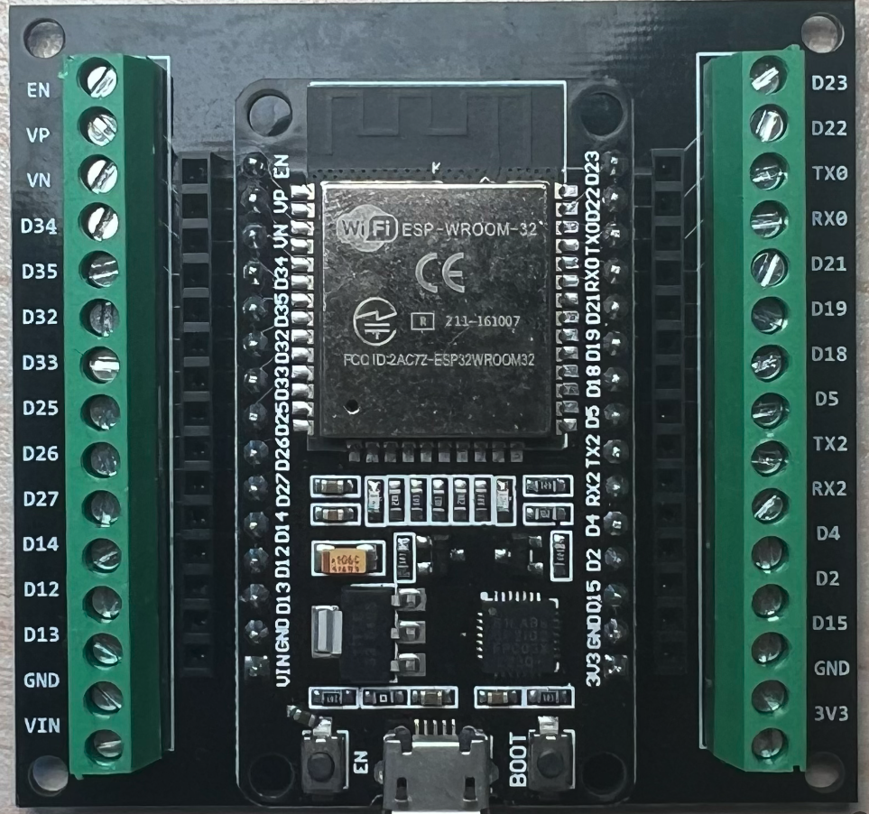
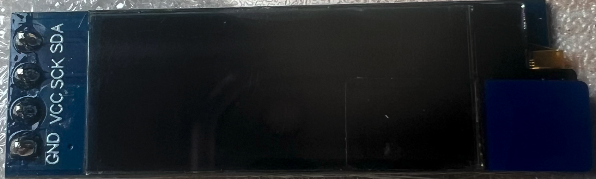

This repo is one part of the long runnign garden project where I try to build something that'll help me grow plants and be a nerd in the process.

Weilding cpp, I'm harassing myself with notifications on what my janky greenhouse is up to... Things like the latest sensor readings. 

## Getting Started

### Setup ESP32

At the project root, create a secretes.ini file and pupulate it the file with the following

```bash
[secrets]
wifi_ssid = "your wifi namme"
wifi_pass = "your wifi password"
```

Assuming you have a MQTT broker running and you're using a different host, port and topic, change the setup function in main.cpp

```bash
const char* MQTT_HOST = "192.168.1.66";
const uint16_t MQTT_PORT = 1883;
const char* MQTT_TOPIC = "pi-peripherals";
```

Upload to the esp32 using the vscode platformio extension's upload buttton

(Optional) Monitor in terminal

```bash
pio device monitor
```

## Troubleshooting: messages not showing on the display

If your publish script sends to `pi-peripherals` but the ESP32 display stays on "MQTT waiting..." or never updates:

1. **Open Serial Monitor** (e.g. `pio device monitor` at 115200). When you publish from the Python script, you should see `[MQTT RX] topic=pi-peripherals len=... payload=...`. If you never see that, the message is not reaching the ESP32 (see steps 2–4). If you do see it, the problem is display or payload format.

2. **Same broker**: The ESP32 uses `MQTT_HOST` and `MQTT_PORT` from `main.cpp` (e.g. `192.168.1.66:1883`). Your Python script’s `.env` must use the same broker: `MQTT_HOST=192.168.1.66`, `MQTT_PORT=1883`. If the script uses `localhost` and the broker runs on another machine, messages never reach the ESP32.

3. **Python script is connected and publishing**: Call `client.connect()` and check it returns `True`. Then call `client.publish(...)` or `client.publish_json(...)`; the client uses `MQTT_TOPIC_PUB` (e.g. `pi-peripherals`) for publish. If the script doesn’t connect or uses a different topic, the ESP32 won’t get messages.

4. **Topic match**: ESP32 subscribes to the topic set in `main.cpp` (`pi-peripherals`). Your script must publish to that exact topic (e.g. `MQTT_TOPIC_PUB=pi-peripherals` in `.env`).

5. **Payload size**: The ESP32 MQTT buffer is set to 512 bytes. Very large messages may be dropped; keep payloads under ~400 bytes if nothing appears.

6. **Display format**: The display shows the raw payload. For two lines use `"line1\nline2"`. If you send JSON, the whole JSON string is shown; for readable lines you can send e.g. `client.publish("pi-peripherals", "Hello\nworld")` or parse JSON in firmware and then call the display.

## Hardware
|item|img|
|-|-|
|Esp32-wroom| |
|Oled display|
